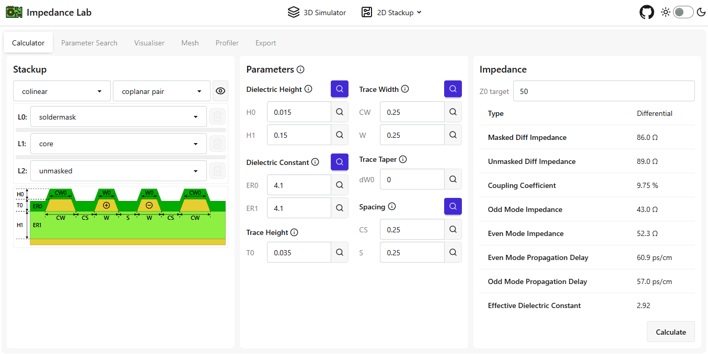

  

# Impedance Lab
> A collection of tools for transmission line design, analysis and visualisation.

## ⚡️2D PCB Stackup
- Transmission line impedance calculator
- Configurable PCB stackup (e.g. microstrip, stripline, ...)
- Different types of transmission lines (e.g. single ended, differential pair, broadside pair, ...)
- Parametric search (e.g. trace width, separation, ...)
- Field visualisation and export

