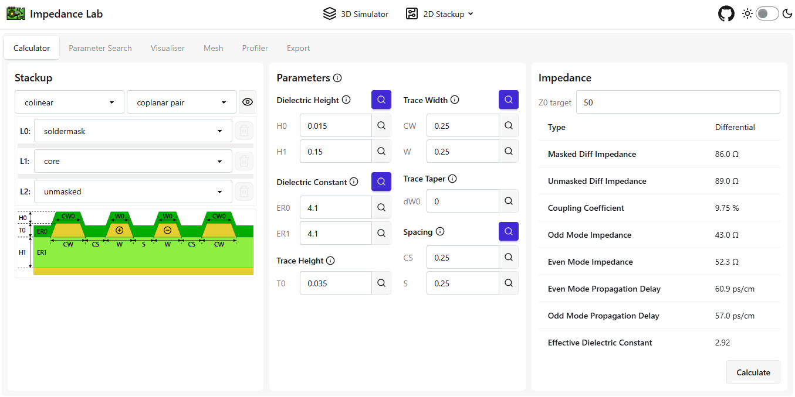
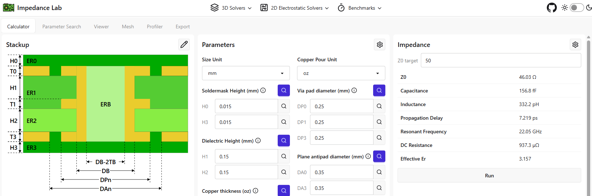

  
  

# Impedance Lab
> A collection of tools for transmission line design, analysis and visualisation.

[Open in your browser here](https://williamyang98.github.io/impedance_lab/)

## ⚡️2D Transmission Line Impedance Calculator 
- Configurable PCB stackup (e.g. microstrip, stripline, ...)
- Different types of transmission lines (e.g. single ended, differential pair, broadside pair, ...)
- Parametric search (e.g. trace width, separation, ...)
- Field visualisation and export

## ⚡️2D Single Ended Via Impedance Calculator
- Configurable PCB stackup (e.g. microstrip, stripline, ...)
- Parametric search (e.g. barrel diameter, pad diameter, reference plane anti-pad, ...)
- Field visualisation and export

