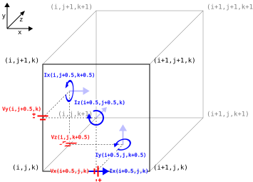
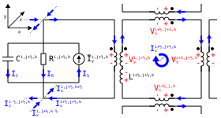
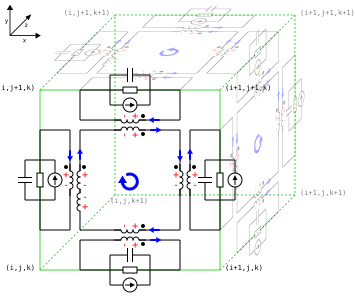

# 3D Equivalent Circuit Finite Difference Time Domain
## Voltage and Current Reformulation
Instead of expressing the field equations in terms of electric and magnetic fields we can define them in terms of voltage and currents.

The electric fields exist along the edges and magnetic fields exists on the faces of the Yee grid. Likewise we can reformulate this so that voltages exist along the edges and circular currents exist on the faces.

### Defining voltage
Consider the electric potential field relationship.
$$
V = -\int \vec{E} \cdot d\vec{l}
$$

From this the voltage along each edge can be defined by the following equations.

$$
\begin{align}
V_{x,t}^{i+\frac{1}{2},j,k} &= - E_{x,t}^{i+\frac{1}{2},j,k} \Delta x^{i+\frac{1}{2}} \\
V_{y,t}^{i,j+\frac{1}{2},k} &= - E_{y,t}^{i,j+\frac{1}{2},k} \Delta y^{j+\frac{1}{2}} \\
V_{z,t}^{i,j,k+\frac{1}{2}} &= - E_{z,t}^{i,j,k+\frac{1}{2}} \Delta z^{k+\frac{1}{2}} \\
\end{align}
$$

### Defining current
Consider Ampere's circuital law.
$$
\oint_{C} \vec{H} \cdot d\vec{l} = I_{enclosed}
$$

Consider the current enclosed along the edge of a Yee grid cell as a result of the surrounding magnetic fields for $\hat{I}_x^{i+\frac{1}{2},j,k}$.

$$
\begin{align}
\hat{I}_x^{i+\frac{1}{2},j,k} &=
H_y^{i+\frac{1}{2},j,k+\frac{1}{2}} \Delta y^j 
- H_z^{i+\frac{1}{2},j+\frac{1}{2},k} \Delta z^k
- H_y^{i+\frac{1}{2},j,k-\frac{1}{2}} \Delta y^j 
+ H_z^{i+\frac{1}{2},j-\frac{1}{2},k} \Delta z^k \\
\hat{I}_x^{i+\frac{1}{2},j,k} &=
I_y^{i+\frac{1}{2},j,k+\frac{1}{2}}
- I_z^{i+\frac{1}{2},j+\frac{1}{2},k}
- I_y^{i+\frac{1}{2},j,k-\frac{1}{2}}
+ I_z^{i+\frac{1}{2},j-\frac{1}{2},k} \\
\end{align}
$$

From this we can show that the edge currents are the sum of circular currents generated on the faces of adjacent the Yee grid cells from the magnetic fields. These circular currents are defined by the following equations.

$$
\begin{align}
I_{x,t+\frac{1}{2}}^{i,j+\frac{1}{2},k+\frac{1}{2}} &= H_{x,t+\frac{1}{2}}^{i,j+\frac{1}{2},k+\frac{1}{2}} \Delta x^i \\
I_{y,t+\frac{1}{2}}^{i+\frac{1}{2},j,k+\frac{1}{2}} &= H_{y,t+\frac{1}{2}}^{i+\frac{1}{2},j,k+\frac{1}{2}} \Delta y^j \\
I_{z,t+\frac{1}{2}}^{i+\frac{1}{2},j+\frac{1}{2},k} &= H_{z,t+\frac{1}{2}}^{i+\frac{1}{2},j+\frac{1}{2},k} \Delta z^k \\
\end{align}
$$

### Defining capacitance, resistance, inductance and current
Capacitance ($C$), inductance ($L$) resistance ($R$) and current ($I$) can be expressed in terms of electrical permittivity ($\varepsilon$), magnetic permeability ($\mu$), conductivity ($\sigma$) and current density ($J$).

$$
\begin{align}
C &= \frac{\varepsilon A}{d} \tag{3.1} \\
L &= \frac{\mu A}{d} \tag{3.2} \\
R &= \frac{L}{\sigma A} \tag{3.3} \\
I &= J A \tag{3.4} \\
\end{align}
$$

## Deriving voltage equations
### Substituting into electric field equations
$$
\begin{align}
\varepsilon^{i+\frac{1}{2},j,k} \frac{E_{x,t}^{i+\frac{1}{2},j,k} - E_{x,t-1}^{i+\frac{1}{2},j,k}}{\Delta t}
+ \sigma^{i+\frac{1}{2},j,k} E_{x,t}^{i+\frac{1}{2},j,k}
+ J_{x,t-\frac{1}{2}}^{i+\frac{1}{2},j,k}
= \frac{1}{\Delta y^j \Delta z^k} \left(
H_{z,t-\frac{1}{2}}^{i+\frac{1}{2},j-\frac{1}{2},k} \Delta z^k
+ H_{y,t-\frac{1}{2}}^{i+\frac{1}{2},j,k+\frac{1}{2}} \Delta y^j
- H_{z,t-\frac{1}{2}}^{i+\frac{1}{2},j+\frac{1}{2},k} \Delta z^k
- H_{y,t-\frac{1}{2}}^{i+\frac{1}{2},j,k-\frac{1}{2}} \Delta y^j
\right) \\
- \frac{\varepsilon^{i+\frac{1}{2},j,k}}{\Delta t \Delta x^{i+\frac{1}{2}}} \left( V_{x,t}^{i+\frac{1}{2},j,k} - V_{x,t-1}^{i+\frac{1}{2},j,k} \right)
- \frac{\sigma^{i+\frac{1}{2},j,k}}{\Delta x^{i+\frac{1}{2}}} V_{x,t}^{i+\frac{1}{2},j,k}
+ J_{x,t-\frac{1}{2}}^{i+\frac{1}{2},j,k}
= \frac{1}{\Delta y^j \Delta z^k} \left(
I_{z,t-\frac{1}{2}}^{i+\frac{1}{2},j-\frac{1}{2},k}
+ I_{y,t-\frac{1}{2}}^{i+\frac{1}{2},j,k+\frac{1}{2}}
- I_{z,t-\frac{1}{2}}^{i+\frac{1}{2},j+\frac{1}{2},k}
- I_{y,t-\frac{1}{2}}^{i+\frac{1}{2},j,k-\frac{1}{2}}
\right) \\
- \frac{\varepsilon^{i+\frac{1}{2},j,k} \Delta y^j \Delta z^k}{\Delta t \Delta x^{i+\frac{1}{2}}} \left( V_{x,t}^{i+\frac{1}{2},j,k} - V_{x,t-1}^{i+\frac{1}{2},j,k} \right)
- \frac{\sigma^{i+\frac{1}{2},j,k} \Delta y^j \Delta z^k}{\Delta x^{i+\frac{1}{2}}} V_{x,t}^{i+\frac{1}{2},j,k}
+ \Delta y^j \Delta z^k J_{x,t-\frac{1}{2}}^{i+\frac{1}{2},j,k}
= I_{z,t-\frac{1}{2}}^{i+\frac{1}{2},j-\frac{1}{2},k}
+ I_{y,t-\frac{1}{2}}^{i+\frac{1}{2},j,k+\frac{1}{2}}
- I_{z,t-\frac{1}{2}}^{i+\frac{1}{2},j+\frac{1}{2},k}
- I_{y,t-\frac{1}{2}}^{i+\frac{1}{2},j,k-\frac{1}{2}}
\\
\end{align}
$$

Substituting capacitance (3.1), resistance (3.3), current (3.4) and $\bar{I}$ representing an external source current gives the following.

$$
\begin{align}
- \frac{C^{i+\frac{1}{2},j,k}}{\Delta t} \left( V_{x,t}^{i+\frac{1}{2},j,k} - V_{x,t-1}^{i+\frac{1}{2},j,k} \right)
- \frac{1}{R^{i+\frac{1}{2},j,k}} V_{x,t}^{i+\frac{1}{2},j,k} + \bar{I}_{x,t-\frac{1}{2}}^{i+\frac{1}{2},j,k}
= I_{z,t-\frac{1}{2}}^{i+\frac{1}{2},j-\frac{1}{2},k}
+ I_{y,t-\frac{1}{2}}^{i+\frac{1}{2},j,k+\frac{1}{2}}
- I_{z,t-\frac{1}{2}}^{i+\frac{1}{2},j+\frac{1}{2},k}
- I_{y,t-\frac{1}{2}}^{i+\frac{1}{2},j,k-\frac{1}{2}} \tag{3.5}
\\
\frac{C^{i+\frac{1}{2},j,k}}{\Delta t} \left( V_{x,t}^{i+\frac{1}{2},j,k} - V_{x,t-1}^{i+\frac{1}{2},j,k} \right)
+ \frac{1}{R^{i+\frac{1}{2},j,k}} V_{x,t}^{i+\frac{1}{2},j,k}
= \bar{I}_{x,t-\frac{1}{2}}^{i+\frac{1}{2},j,k}
- I_{z,t-\frac{1}{2}}^{i+\frac{1}{2},j-\frac{1}{2},k}
- I_{y,t-\frac{1}{2}}^{i+\frac{1}{2},j,k+\frac{1}{2}}
+ I_{z,t-\frac{1}{2}}^{i+\frac{1}{2},j+\frac{1}{2},k}
+ I_{y,t-\frac{1}{2}}^{i+\frac{1}{2},j,k-\frac{1}{2}}
\\
\left( 1 + \frac{\Delta t}{R^{i+\frac{1}{2},j,k} C^{i+\frac{1}{2},j,k}} \right) V_{x,t}^{i+\frac{1}{2},j,k}
= V_{x,t-1}^{i+\frac{1}{2},j,k}
+ \frac{\Delta t}{C^{i+\frac{1}{2},j,k}} \left(
\bar{I}_{x,t-\frac{1}{2}}^{i+\frac{1}{2},j,k}
- I_{z,t-\frac{1}{2}}^{i+\frac{1}{2},j-\frac{1}{2},k}
- I_{y,t-\frac{1}{2}}^{i+\frac{1}{2},j,k+\frac{1}{2}}
+ I_{z,t-\frac{1}{2}}^{i+\frac{1}{2},j+\frac{1}{2},k}
+ I_{y,t-\frac{1}{2}}^{i+\frac{1}{2},j,k-\frac{1}{2}}
\right)
\\
\end{align}
$$

Substitute the following
$$
\begin{align}
\tau^{i+\frac{1}{2},j,k}  &= R^{i+\frac{1}{2},j,k} C^{i+\frac{1}{2},j,k} \\
\alpha^{i+\frac{1}{2},j,k} &= \frac{\tau^{i+\frac{1}{2},j,k}}{\tau^{i+\frac{1}{2},j,k} + \Delta t} \tag{3.6} \\
\beta^{i+\frac{1}{2},j,k} &= \frac{\Delta t}{C^{i+\frac{1}{2},j,k}} \tag{3.7} \\
\end{align}
$$

### Update equations
$$
\begin{align}
V_{x,t}^{i+\frac{1}{2},j,k} &=
\alpha^{i+\frac{1}{2},j,k} \left[
V_{x,t-1}^{i+\frac{1}{2},j,k}
+ \beta^{i+\frac{1}{2},j,k} \left(
\bar{I}_{x,t-\frac{1}{2}}^{i+\frac{1}{2},j,k}
- I_{z,t-\frac{1}{2}}^{i+\frac{1}{2},j-\frac{1}{2},k}
- I_{y,t-\frac{1}{2}}^{i+\frac{1}{2},j,k+\frac{1}{2}}
+ I_{z,t-\frac{1}{2}}^{i+\frac{1}{2},j+\frac{1}{2},k}
+ I_{y,t-\frac{1}{2}}^{i+\frac{1}{2},j,k-\frac{1}{2}}
\right)
\right] \tag{3.8} \\
V_{y,t}^{i,j+\frac{1}{2},k} &=
\alpha^{i,j+\frac{1}{2},k} \left[
V_{y,t-1}^{i,j+\frac{1}{2},k}
+ \beta^{i,j+\frac{1}{2},k} \left(
\bar{I}_{y,t-\frac{1}{2}}^{i,j+\frac{1}{2},k}
- I_{x,t-\frac{1}{2}}^{i,j+\frac{1}{2},k-\frac{1}{2}}
- I_{z,t-\frac{1}{2}}^{i+\frac{1}{2},j+\frac{1}{2},k}
+ I_{x,t-\frac{1}{2}}^{i,j+\frac{1}{2},k+\frac{1}{2}}
+ I_{z,t-\frac{1}{2}}^{i-\frac{1}{2},j+\frac{1}{2},k}
\right)
\right] \tag{3.9} \\
V_{z,t}^{i,j,k+\frac{1}{2}} &= \alpha^{i,j,k+\frac{1}{2}} \left[
V_{z,t-1}^{i,j,k+\frac{1}{2}}
+ \beta^{i,j,k+\frac{1}{2}} \left(
\bar{I}_{z,t-\frac{1}{2}}^{i,j,k+\frac{1}{2}}
- I_{y,t-\frac{1}{2}}^{i-\frac{1}{2},j,k+\frac{1}{2}}
- I_{x,t-\frac{1}{2}}^{i,j+\frac{1}{2},k+\frac{1}{2}}
+ I_{y,t-\frac{1}{2}}^{i+\frac{1}{2},j,k+\frac{1}{2}}
+ I_{x,t-\frac{1}{2}}^{i,j-\frac{1}{2},k+\frac{1}{2}}
\right)
\right] \tag{3.10} \\
\end{align}
$$

## Deriving current equations
### Substituting into magnetic field equations
$$
\begin{align}
\mu^{i,j+\frac{1}{2},k+\frac{1}{2}} \frac{H_{x,t+\frac{1}{2}}^{i,j+\frac{1}{2},k+\frac{1}{2}} - H_{x,t-\frac{1}{2}}^{i,j+\frac{1}{2},k+\frac{1}{2}}}{\Delta t} =
- \frac{1}{\Delta y^{j+\frac{1}{2}} \Delta z^{k+\frac{1}{2}}} \left(
E_{z,t}^{i,j,k+\frac{1}{2}} \Delta z^{k+\frac{1}{2}}
+ E_{y,t}^{i,j+\frac{1}{2},k+1} \Delta y^{j+\frac{1}{2}}
- E_{z,t}^{i,j+1,k+\frac{1}{2}} \Delta z^{k+\frac{1}{2}}
- E_{y,t}^{i,j+\frac{1}{2},k} \Delta y^{j+\frac{1}{2}}
\right) \\
\frac{\mu^{i,j+\frac{1}{2},k+\frac{1}{2}}}{\Delta t \Delta x^i} \left( I_{x,t+\frac{1}{2}}^{i,j+\frac{1}{2},k+\frac{1}{2}} - I_{x,t-\frac{1}{2}}^{i,j+\frac{1}{2},k+\frac{1}{2}} \right) =
\frac{1}{\Delta y^{j+\frac{1}{2}} \Delta z^{k+\frac{1}{2}}} \left(
V_{z,t}^{i,j,k+\frac{1}{2}}
+ V_{y,t}^{i,j+\frac{1}{2},k+1}
- V_{z,t}^{i,j+1,k+\frac{1}{2}}
- V_{y,t}^{i,j+\frac{1}{2},k}
\right) \\
\frac{\mu^{i,j+\frac{1}{2},k+\frac{1}{2}} \Delta y^{j+\frac{1}{2}} \Delta z^{k+\frac{1}{2}}}{\Delta t \Delta x^i} \left( I_{x,t+\frac{1}{2}}^{i,j+\frac{1}{2},k+\frac{1}{2}} - I_{x,t-\frac{1}{2}}^{i,j+\frac{1}{2},k+\frac{1}{2}} \right) =
V_{z,t}^{i,j,k+\frac{1}{2}}
+ V_{y,t}^{i,j+\frac{1}{2},k+1}
- V_{z,t}^{i,j+1,k+\frac{1}{2}}
- V_{y,t}^{i,j+\frac{1}{2},k}
\\
\end{align}
$$

Substituting inductance (3.2) gives the following
$$
\begin{align}
\frac{L^{i,j+\frac{1}{2},k+\frac{1}{2}}}{\Delta t} \left( I_{x,t+\frac{1}{2}}^{i,j+\frac{1}{2},k+\frac{1}{2}} - I_{x,t-\frac{1}{2}}^{i,j+\frac{1}{2},k+\frac{1}{2}} \right) =
V_{z,t}^{i,j,k+\frac{1}{2}}
+ V_{y,t}^{i,j+\frac{1}{2},k+1}
- V_{z,t}^{i,j+1,k+\frac{1}{2}}
- V_{y,t}^{i,j+\frac{1}{2},k}
\tag{3.11} \\
I_{x,t+\frac{1}{2}}^{i,j+\frac{1}{2},k+\frac{1}{2}} =
I_{x,t-\frac{1}{2}}^{i,j+\frac{1}{2},k+\frac{1}{2}}
\frac{\Delta t}{L^{i,j+\frac{1}{2},k+\frac{1}{2}}} \left(
V_{z,t}^{i,j,k+\frac{1}{2}}
+ V_{y,t}^{i,j+\frac{1}{2},k+1}
- V_{z,t}^{i,j+1,k+\frac{1}{2}}
- V_{y,t}^{i,j+\frac{1}{2},k}
\right) \\
\end{align}
$$

Substitute the following
$$
\phi^{i,j+\frac{1}{2},k+\frac{1}{2}} = \frac{\Delta t}{L^{i,j+\frac{1}{2},k+\frac{1}{2}}} \tag{3.12}
$$

### Update equations
$$
\begin{align}
I_{x,t+\frac{1}{2}}^{i,j+\frac{1}{2},k+\frac{1}{2}} &=
I_{x,t-\frac{1}{2}}^{i,j+\frac{1}{2},k+\frac{1}{2}}
+ \phi^{i,j+\frac{1}{2},k+\frac{1}{2}} \left(
V_{z,t}^{i,j,k+\frac{1}{2}}
+ V_{y,t}^{i,j+\frac{1}{2},k+1}
- V_{z,t}^{i,j+1,k+\frac{1}{2}}
- V_{y,t}^{i,j+\frac{1}{2},k}
\right) \tag{3.13} \\
I_{y,t+\frac{1}{2}}^{i+\frac{1}{2},j,k+\frac{1}{2}} &=
I_{y,t-\frac{1}{2}}^{i+\frac{1}{2},j,k+\frac{1}{2}}
+ \phi^{i+\frac{1}{2},j,k+\frac{1}{2}} \left(
V_{x,t}^{i+\frac{1}{2},j,k}
+ V_{z,t}^{i+1,j,k+\frac{1}{2}}
- V_{x,t}^{i+\frac{1}{2},j,k+1}
- V_{z,t}^{i,j,k+\frac{1}{2}}
\right) \tag{3.14} \\
I_{z,t+\frac{1}{2}}^{i+\frac{1}{2},j+\frac{1}{2},k} &=
I_{z,t-\frac{1}{2}}^{i+\frac{1}{2},j+\frac{1}{2},k}
+ \phi^{i+\frac{1}{2},j+\frac{1}{2},k} \left(
V_{y,t}^{i,j+\frac{1}{2},k}
+ V_{x,t}^{i+\frac{1}{2},j+1,k}
- V_{y,t}^{i+1,j+\frac{1}{2},k}
- V_{x,t}^{i+\frac{1}{2},j,k}
\right) \tag{3.15} \\
\end{align}
$$

## Circuit diagram of equivalent circuit Yee cell face
Equation 3.5 is Kirchoff's current law for the edge currents.
$$
I_{edge} = - C \frac{dV}{dt} - \frac{V}{R} + I_{source} = \sum I_{face}
$$

Equation 3.11 is Kirchoff's voltage law for the face voltages.
$$
L \frac{di}{dt} + \sum V_{edge} = 0
$$

## Circuit diagram of equivalent circuit Yee cell
This circuit connects with the other faces for all cells as shown below.

