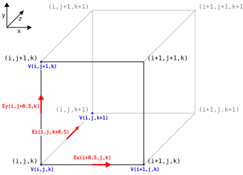

# 3D Electrostatic
## Maxwell's equations
$$
\begin{align}
\frac{\delta \vec{D}}{\delta t} + \vec{J} &= \nabla \times \vec{H} \\
\frac{\delta \vec{B}}{\delta t} &= -\nabla \times \vec{E} \\
\nabla \cdot \vec{D} &= \rho \\
\nabla \cdot \vec{B} &= 0 \\
\end{align}
$$

Where
$$
\begin{align}
\vec{D} &= \varepsilon \vec{E} \\
\vec{B} &= \mu \vec{H} \\
\end{align}
$$

### Electrostatic scenario
Since we are solving for the electrostatic result $\frac{\delta}{\delta t} = 0$ and $\vec{J} = 0$
$$
\begin{align}
\nabla \times \vec{H} &= 0 \\
\nabla \times \vec{E} &= 0 \\
\nabla \cdot \vec{D} &= \rho \\
\nabla \cdot \vec{B} &= 0 \\
\end{align}
$$

### Defining voltage scalar field
Therefore we get path independence in the electric field at any point along any path
$$\nabla \times \vec{E} = \lim_{A \to 0} \frac{1}{A} \oint_{C} \vec{E} \cdot d\vec{l} = 0$$

Which means we can define the electric field as a gradient of a scalar voltage field which is called the Poincaré lemma
$$
\begin{align}
\vec{E} &= -\nabla V \\
V(r) &= -\int_{r_0}^{r} \vec{E} \cdot d\vec{l} \\
\end{align}
$$

### Substituting into Gauss's law to get the Laplacian
$$
\begin{align}
\nabla \cdot \vec{D} &= \rho \\
\nabla \cdot \vec{E} &= \frac{\rho}{\varepsilon} \\
\nabla \cdot (-\nabla V) &= \frac{\rho}{\varepsilon} \\
\nabla^2 V &= - \frac{\rho}{\varepsilon} \\
\end{align}
$$

For charge free regions such as the space outside of charged regions which are usually a forcing voltage source we get
$$\nabla^2 V = 0$$

## Electrostatic cell
The colocated electrostatic cell has the electric fields along the edges of the cells, and voltage scalar potential on the corners of the cells.

## Deriving field equations
### Expanding continuous form
$$
\newcommand{\oiint}{ {\subset\!\supset} \llap{\iint} }
\begin{align}
\iiint_{V} (\nabla \cdot \vec{E}) \space dV &= \oiint_{S} (\vec{E} \cdot \vec{n}) \space dS \\
\iiint_{V}\frac{\rho}{\varepsilon} \space dV &= \oiint_{S} (\vec{E} \cdot \vec{n}) \space dS \\
\end{align}
$$

### Discretise against grid
$$
E_{x}^{i+\frac{1}{2},j,k} \Delta y^j \Delta z^k
+ E_{y}^{i,j+\frac{1}{2},k} \Delta x^i \Delta z^k
+ E_{z}^{i,j,k+\frac{1}{2}} \Delta x^i \Delta y^j
- E_{x}^{i-\frac{1}{2},j,k} \Delta y^j \Delta z^k
- E_{y}^{i,j-\frac{1}{2},k} \Delta x^i \Delta z^k
- E_{z}^{i,j,k-\frac{1}{2}} \Delta x^i \Delta y^j =
\frac{\rho^{i,j,k}}{\varepsilon^{i,j,k}}(\Delta x^i \Delta y^j \Delta z^k)
$$
$$
\frac{E_{x}^{i+\frac{1}{2},j,k}}{\Delta x^i}
+ \frac{E_{y}^{i,j+\frac{1}{2},k}}{\Delta y^j}
+ \frac{E_{z}^{i,j,k+\frac{1}{2}}}{\Delta z^k}
- \frac{E_{x}^{i-\frac{1}{2},j,k}}{\Delta x^i}
- \frac{E_{y}^{i,j-\frac{1}{2},k}}{\Delta y^j}
- \frac{E_{z}^{i,j,k-\frac{1}{2}}}{\Delta z^k} =
\frac{\rho^{i,j,k}}{\varepsilon^{i,j,k}}
$$

### Reducing error of discretisation
We can rescale the bounding volume of the divergence operator by a factor of $s$ along each axis.
If $s \to 0$ then the error of the discretisation as a result of $\vec{E}$ varying across each face of the discretisation grid approaches zero. However $s \neq 0$ since the divergence is defined for a finite non-zero volume.

$$
\frac{E_{x}^{i+\frac{1}{2},j,k}}{\Delta x^i}
+ \frac{E_{y}^{i,j+\frac{1}{2},k}}{\Delta y^j}
+ \frac{E_{z}^{i,j,k+\frac{1}{2}}}{\Delta z^k}
- \frac{E_{x}^{i-\frac{1}{2},j,k}}{\Delta x^i}
- \frac{E_{y}^{i,j-\frac{1}{2},k}}{\Delta y^j}
- \frac{E_{z}^{i,j,k-\frac{1}{2}}}{\Delta z^k} =
\lim_{s \to 0} s \space \frac{\rho^{i,j,k}}{\varepsilon^{i,j,k}}
$$

### Discretising voltage
$$
\begin{align}
E_x^{i+\frac{1}{2},j,k} &= \frac{V^{i+1,j,k} - V^{i,j,k}}{\Delta x^{i+\frac{1}{2}}} \\
E_y^{i,j+\frac{1}{2},k} &= \frac{V^{i,j+1,k} - V^{i,j,k}}{\Delta y^{j+\frac{1}{2}}} \\
E_z^{i,j,k+\frac{1}{2}} &= \frac{V^{i,j,k+1} - V^{i,j,k}}{\Delta z^{k+\frac{1}{2}}} \\
\end{align}
$$

### Deriving voltage equation
Substituting our discretised voltage gives
$$
\begin{align}
  \frac{V^{i+1,j,k} - V^{i,j,k}}{\Delta x^i \Delta x^{i+\frac{1}{2}}}
+ \frac{V^{i,j+1,k} - V^{i,j,k}}{\Delta y^j \Delta y^{j+\frac{1}{2}}}
+ \frac{V^{i,j,k+1} - V^{i,j,k}}{\Delta z^k \Delta z^{k+\frac{1}{2}}}
- \frac{V^{i,j,k} - V^{i-1,j,k}}{\Delta x^i \Delta x^{i-\frac{1}{2}}}
- \frac{V^{i,j,k} - V^{i,j-1,k}}{\Delta y^j \Delta y^{j-\frac{1}{2}}}
- \frac{V^{i,j,k} - V^{i,j,k-1}}{\Delta z^k \Delta z^{k-\frac{1}{2}}} =
\lim_{s \to 0} s \space \frac{\rho^{i,j,k}}{\varepsilon^{i,j,k}}
\end{align}
$$

## Matrix form
Using the voltage equation we can express it in the 3 dimensional electrostatic problem in the form $A \mathbf{v}=\mathbf{b}$.

For a 3D grid with $N = N_x N_y N_z$ cells with $M = (N_x+1)(N_y+1)(N_z+1)$ voltage points.

$$
A = {
\begin{bmatrix}
a_{0,0} & a_{0,1} & \cdots & a_{0,M-1} \\
a_{1,0} & a_{1,1} & \cdots & a_{1,M-1} \\
\vdots &\vdots & \ddots & \vdots \\
a_{M-1,0} & a_{M-1,1} & \cdots & a_{M-1,M-1} \\
\end{bmatrix}}
, \qquad
\mathbf{v} = {
\begin{bmatrix}
v_{0} \\
v_{1} \\
\vdots \\
v_{M-1}
\end{bmatrix}}
,\qquad
\mathbf{b} = {
\begin{bmatrix}
b_{0} \\
b_{1} \\
\vdots \\
b_{M-1}
\end{bmatrix}}
$$

where 
$$
v_m = V^{i,j,k} \quad
\begin{cases}
0 \le i < N_x+1 \\
0 \le j < N_y+1 \\
0 \le k < N_z+1 \\
\end{cases}
$$

where $m = i + j (N_x+1) + k (N_x+1)(N_y+1)$ for row major ordering in memory.

### Deriving A matrix and b vector
Each row in the $A$ matrix corresponds to the divergence constraint expressed in the voltage equation.

$$
a_{m,n} = 
\begin{cases}
- \frac{1}{\Delta x^i \Delta x^{i+\frac{1}{2}}}
- \frac{1}{\Delta y^j \Delta y^{j+\frac{1}{2}}}
- \frac{1}{\Delta z^k \Delta z^{k+\frac{1}{2}}}
- \frac{1}{\Delta x^i \Delta x^{i-\frac{1}{2}}}
- \frac{1}{\Delta y^j \Delta y^{j-\frac{1}{2}}}
- \frac{1}{\Delta z^k \Delta z^{k-\frac{1}{2}}}
& \text{if } n = m = (i, j, k) \\
\frac{1}{\Delta x^i \Delta x^{i+\frac{1}{2}}} & \text{if } n = (i+1,j,k) \text{ and } i < N_x \\
\frac{1}{\Delta x^i \Delta x^{i-\frac{1}{2}}} & \text{if } n = (i-1,j,k) \text{ and } i > 0 \\
\frac{1}{\Delta y^j \Delta y^{j+\frac{1}{2}}} & \text{if } n = (i,j+1,k) \text{ and } j < N_y \\
\frac{1}{\Delta y^j \Delta y^{j-\frac{1}{2}}} & \text{if } n = (i,j-1,k) \text{ and } j > 0 \\
\frac{1}{\Delta z^k \Delta z^{k+\frac{1}{2}}} & \text{if } n = (i,j,k+1) \text{ and } k < N_z \\
\frac{1}{\Delta z^k \Delta z^{k-\frac{1}{2}}} & \text{if } n = (i,j,k-1) \text{ and } k > 0 \\
0 & \text{otherwise} \\
\end{cases}
\tag{2.1}
$$

$$
\begin{align}
b_m &= \lim_{s \to 0} s \space \frac{\rho^{i,j,k}}{\varepsilon^{i,j,k}} \\
\end{align}
$$

### Constraint for charge free regions
For regions with no forcing voltage potential the region is free of charges so

$$
b_m = 0 \tag{2.2}
$$

### Boundary condition for voltage sources
Instead of the divergence constraint we force that particular voltage node to the input voltage at that location in the electrostatic problem.

$$
a_{m,n} =
\begin{cases}
1 & \text{if } n = m = (i,j,k) \\
0 & \text{otherwise} \\
\end{cases}
\tag{2.3}
$$

$$
b_{m} = V_{in}^{i,j,k} \tag{2.4}
$$

### Proving the system is weakly diagonally dominant
To prove this square system of form $A\mathbf{v} = \mathbf{b}$ is potentially solvable it can be shown that it is weakly diagonally dominant

$$
|a_{m,m}| \ge \sum_{n \neq m} |a_{m,n}| \quad \forall m
$$

This can be proven for each row $m = (i,j,k)$ in $A$

$$
\begin{align}
|a_{m,m}| &= 
\frac{1}{\Delta x^i \Delta x^{i+\frac{1}{2}}}
+ \frac{1}{\Delta y^j \Delta y^{j+\frac{1}{2}}}
+ \frac{1}{\Delta z^k \Delta z^{k+\frac{1}{2}}}
+ \frac{1}{\Delta x^i \Delta x^{i-\frac{1}{2}}}
+ \frac{1}{\Delta y^j \Delta y^{j-\frac{1}{2}}}
+ \frac{1}{\Delta z^k \Delta z^{k-\frac{1}{2}}} \\
&\ge \sum_{n \neq m} |a_{m,n}| \\
\end{align}
$$

## Iterative vs direct solvers
The electrostatic system in the form $A\mathbf{v} =\mathbf{b}$ can be solved iteratively or directly. The direct solver library used is a C library called SuperLU which uses a variety of direct matrix solvers compiled and executued in WebAssembly (WASM) for speed. This is the method used to solve electrostatic 2D problems which are faster with CPU based direct matrix solvers. The iterative solver uses WebGPU to leverage highly parallel compute capable GPUs from the browser which is more suitable for electrostatic 3D problems which cannot be easily directly solved without a large memory footprint.

### Jacobi method
The Jacobi method is provably convergent if the system $A\mathbf{v} = \mathbf{b}$ is strictly diagonally dominant, but is still probably convergent if it is only weakly diagonally dominant which was just proven.

The system matrix can be decomposed into a diagonal, lower triangular and upper triangular matrix.
$$
A = D+L+U
\quad \text{where} \quad
D = \begin{bmatrix}
a_{0,0} & 0 & \cdots & 0 \\
0 & a_{1,1} & \cdots & 0\\
\vdots & \vdots & \ddots & \vdots \\
0 & 0 & \cdots & a_{M-1,M-1} \\
\end{bmatrix}
\quad \text{and} \quad
L+U = \begin{bmatrix}
0 & a_{0,1} & \cdots & a_{0,M-1} \\
a_{1,0} & 0 & \cdots & a_{1,M-1} \\
\vdots & \vdots & \ddots & \vdots \\
a_{M-1,0} & a_{M-1,1} & \cdots & 0 \\
\end{bmatrix}
$$

Where the Jacobi method can be expressed as an iterative process over $k$ steps

$$
\mathbf{v}^{k+1} = \omega D^{-1} \left( \mathbf{b} - (L+U)\mathbf{v}^k \right) + (1-\omega) \mathbf{v}^k, \quad 0 < \omega \le 1
$$

This can be expressed in per row form as
$$
\begin{align}
v_m^{k+1} = \frac{\omega}{a_{m,m}} \left( b_m - \sum_{n \neq m} a_{m,n} v_n^k \right) + (1-\omega) \space v_m^k
\end{align}
$$

## Multigrid iterative solvers
In iterative multigrid solvers we have multiple levels of the electrostatic grid with differing levels of detail. This involves transfering values between low and high resolution grids. Lower resolution grids can resolve low frequency details but has more higher frequency errors with less cells. Whereas high resolution grids can resolve high frequency details with more with higher low frequency error with greater cells. By iteratively solving lower resolution grids then transferring this to higher resolution grids you can achieve convergence within fewer steps than using a single high resolution grid.

### Transferring residuals instead of the approximate solution
Moving between these different level grids in multigrid involves transferring values between them through upsampling and downsampling. Instead of doing this for the scalar field $\mathbf{v}^k$ this can be done a residual scalar field $\mathbf{r}^k$ instead.

Let $\hat{\mathbf{v}}$ be the exact solution such that $\mathbf{e}^k = \hat{\mathbf{v}} - \mathbf{v}^k$ and
$\mathbf{r}^k = \mathbf{b} - A\mathbf{v}^k$.

It can be shown that
$$
A\mathbf{e}^k = A \left(\hat{\mathbf{v}} - \mathbf{v}^k \right) = \mathbf{b} - A\mathbf{v}^k = \mathbf{r}^k
$$

While $\hat{\mathbf{v}}$ and $\mathbf{e}^k$ cannot be computed directly we can instead compute $\mathbf{r}^k$.

Instead of upsampling or downsampling $\mathbf{v}^k$ which would only amplify low frequency errors on upsampling or aliases high frequency information on downsampling, we use the residual $\mathbf{r}^k$ instead which adds low frequency corrections on upsampling, and keeps high frequency corrections in the higher resolution multigrid on downsampling.

### Jacobi method with residuals
Substituting $L+U = A-D$

$$
\begin{align}
\mathbf{v}^{k+1} &= \omega D^{-1} \mathbf{b} - \omega D^{-1} A \mathbf{v}^k + \omega D^{-1} D \mathbf{v}^k +  \mathbf{v}^k -\omega \mathbf{v}^k \\
\mathbf{v}^{k+1} &= \omega D^{-1} \left( \mathbf{b} - A\mathbf{v}^k \right) + \mathbf{v}^k \\
\end{align}
$$

This can be expressed as the addition of a weighted residual $\mathbf{r}$

$$
\begin{align}
\mathbf{r}^{k} &= \mathbf{b} - A\mathbf{v}^k \\
\mathbf{v}^{k+1} &= \mathbf{v}^k + \omega D^{-1} \mathbf{r}^k \\
\end{align}
$$

This can be expressed in per row form as
$$
\begin{align}
r_m^k &= b_m - \sum a_{m,n} v_n^k \tag{2.5} \\
v_m^{k+1} &= v_m^k + \omega \frac{r_m^k}{a_{m,m}} \tag{2.6} \\
\end{align}
$$