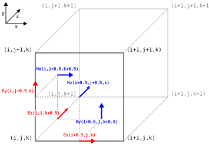

# 3D Finite Difference Time Domain
## Maxwell's equations
$$
\begin{align}
\frac{\delta \vec{D}}{\delta t} + \vec{J} &= \nabla \times \vec{H} \\
\frac{\delta \vec{B}}{\delta t} &= -\nabla \times \vec{E} \\
\nabla \cdot \vec{D} &= \rho \\
\nabla \cdot \vec{B} &= 0 \\
\end{align}
$$

Where
$$
\begin{align}
\vec{D} &= \varepsilon \vec{E} \\
\vec{B} &= \mu \vec{H} \\
\end{align}
$$

### Joule loss
$$
\begin{align}
\vec{J} &= \vec{J}_{loss} + \vec{J}_{input} \\
\vec{J} &= \sigma \vec{E} + \vec{J}_{input} \\
\end{align}
$$

## Yee Grid
The Yee grid has the electric fields along the edges of the cells, and magnetics fields on the faces of the cells.
This is called a staggered grid which makes it easier to discretise the curl operator and satisfy zero divergence.
Additionally the update equations are also staggered and interleaved, with the electric fields and magnetic fields updated after each other in half time steps.

## Deriving electric field equations
### Expand continuous form
$$
\begin{align}
\frac{\delta \vec{D}}{\delta t} + \vec{J} &= \nabla \times \vec{H} \\
\frac{\delta \vec{D}}{\delta t} + \vec{J} &= \lim_{A \to 0} \frac{1}{A} \oint_{C} \vec{H} \cdot d\vec{l} \\
\varepsilon \frac{\delta \vec{E}}{\delta t} + \sigma \vec{E} + \vec{J}_{input} &= \lim_{A \to 0} \frac{1}{A} \oint_{C} \vec{H} \cdot d\vec{l} \\
\end{align}
$$

### Discretise against Yee grid
$$
\begin{align}
\varepsilon^{i+\frac{1}{2},j,k} \frac{E_{x,t}^{i+\frac{1}{2},j,k} - E_{x,t-1}^{i+\frac{1}{2},j,k}}{\Delta t} +
\sigma^{i+\frac{1}{2},j,k} E_{x,t}^{i+\frac{1}{2},j,k} + J_{x,t-\frac{1}{2}}^{i+\frac{1}{2},j,k} =
\frac{1}{\Delta y^j \Delta z^k} \left(
H_{z,t-\frac{1}{2}}^{i+\frac{1}{2},j-\frac{1}{2},k} \Delta z^k
+ H_{y,t-\frac{1}{2}}^{i+\frac{1}{2},j,k+\frac{1}{2}} \Delta y^j
- H_{z,t-\frac{1}{2}}^{i+\frac{1}{2},j+\frac{1}{2},k} \Delta z^k
- H_{y,t-\frac{1}{2}}^{i+\frac{1}{2},j,k-\frac{1}{2}} \Delta y^j
\right) \\
\left( 1 + \frac{\sigma^{i+\frac{1}{2},j,k}}{\varepsilon^{i+\frac{1}{2},j,k}} \Delta t \right) E_{x,t}^{i+\frac{1}{2},j,k} =
E_{x,t-1}^{i+\frac{1}{2},j,k}
+ \frac{\Delta t}{\varepsilon^{i+\frac{1}{2},j,k}} \left(
\frac{H_{z,t-\frac{1}{2}}^{i+\frac{1}{2},j-\frac{1}{2},k}}{\Delta y^j}
+ \frac{H_{y,t-\frac{1}{2}}^{i+\frac{1}{2},j,k+\frac{1}{2}}}{\Delta z^k}
- \frac{H_{z,t-\frac{1}{2}}^{i+\frac{1}{2},j+\frac{1}{2},k}}{\Delta y^j}
- \frac{H_{y,t-\frac{1}{2}}^{i+\frac{1}{2},j,k-\frac{1}{2}}}{\Delta z^k}
- J_{x,t-\frac{1}{2}}^{i+\frac{1}{2},j,k}
\right)
\end{align}
$$

Substitute the following

$$
\begin{align}
\alpha^{i+\frac{1}{2},j,k} &= \frac{1}{1+\frac{\sigma^{i+\frac{1}{2},j,k}}{\varepsilon^{i+\frac{1}{2},j,k}} \Delta t} \tag{1.1} \\
\beta^{i+\frac{1}{2},j,k} &= \frac{\Delta t}{\varepsilon^{i+\frac{1}{2},j,k}} \tag{1.2} \\
\end{align}
$$

### Update equations

$$
\begin{align}
E_{x,t}^{i+\frac{1}{2},j,k} &= \alpha^{i+\frac{1}{2},j,k} \left[
E_{x,t-1}^{i+\frac{1}{2},j,k}
+ \beta^{i+\frac{1}{2},j,k} \left(
\frac{H_{z,t-\frac{1}{2}}^{i+\frac{1}{2},j-\frac{1}{2},k}}{\Delta y^j}
+ \frac{H_{y,t-\frac{1}{2}}^{i+\frac{1}{2},j,k+\frac{1}{2}}}{\Delta z^k}
- \frac{H_{z,t-\frac{1}{2}}^{i+\frac{1}{2},j+\frac{1}{2},k}}{\Delta y^j}
- \frac{H_{y,t-\frac{1}{2}}^{i+\frac{1}{2},j,k-\frac{1}{2}}}{\Delta z^k}
- J_{x,t-\frac{1}{2}}^{i+\frac{1}{2},j,k}
\right)
\right] \tag{1.3} \\
E_{y,t}^{i,j+\frac{1}{2},k} &= \alpha^{i,j+\frac{1}{2},k} \left[
E_{y,t-1}^{i,j+\frac{1}{2},k}
+ \beta^{i,j+\frac{1}{2},k} \left(
\frac{H_{x,t-\frac{1}{2}}^{i,j+\frac{1}{2},k-\frac{1}{2}}}{\Delta z^k}
+ \frac{H_{z,t-\frac{1}{2}}^{i+\frac{1}{2},j+\frac{1}{2},k}}{\Delta x^i}
- \frac{H_{x,t-\frac{1}{2}}^{i,j+\frac{1}{2},k+\frac{1}{2}}}{\Delta z^k}
- \frac{H_{z,t-\frac{1}{2}}^{i-\frac{1}{2},j+\frac{1}{2},k}}{\Delta x^i}
- J_{y,t-\frac{1}{2}}^{i,j+\frac{1}{2},k}
\right)
\right] \tag{1.4} \\
E_{z,t}^{i,j,k+\frac{1}{2}} &= \alpha^{i,j,k+\frac{1}{2}} \left[
E_{z,t-1}^{i,j,k+\frac{1}{2}}
+ \beta^{i,j,k+\frac{1}{2}} \left(
\frac{H_{y,t-\frac{1}{2}}^{i-\frac{1}{2},j,k+\frac{1}{2}}}{\Delta x^i}
+ \frac{H_{x,t-\frac{1}{2}}^{i,j+\frac{1}{2},k+\frac{1}{2}}}{\Delta y^j}
- \frac{H_{y,t-\frac{1}{2}}^{i+\frac{1}{2},j,k+\frac{1}{2}}}{\Delta x^i}
- \frac{H_{x,t-\frac{1}{2}}^{i,j-\frac{1}{2},k+\frac{1}{2}}}{\Delta y^j}
- J_{z,t-\frac{1}{2}}^{i,j,k+\frac{1}{2}}
\right)
\right] \tag{1.5} \\
\end{align}
$$

## Deriving magnetic field equations
### Expand continuous form
$$
\begin{align}
\frac{\delta \vec{B}}{\delta t} &= -\nabla \times \vec{E} \\
\mu \frac{\delta \vec{H}}{\delta t} &= -\nabla \times \vec{E} \\
\mu \frac{\delta \vec{H}}{\delta t} &= -\lim_{A \to 0} \frac{1}{A} \oint_{C} \vec{E} \cdot d\vec{l} \\
\end{align}
$$

### Discretise against Yee grid
$$
\begin{align}
\mu^{i,j+\frac{1}{2},k+\frac{1}{2}} \frac{H_{x,t+\frac{1}{2}}^{i,j+\frac{1}{2},k+\frac{1}{2}} - H_{x,t-\frac{1}{2}}^{i,j+\frac{1}{2},k+\frac{1}{2}}}{\Delta t} &=
-\frac{1}{\Delta y^{j+\frac{1}{2}} \Delta z^{k+\frac{1}{2}}} \left(
E_{z,t}^{i,j,k+\frac{1}{2}} \Delta z^{k+\frac{1}{2}}
+ E_{y,t}^{i,j+\frac{1}{2},k+1} \Delta y^{j+\frac{1}{2}}
- E_{z,t}^{i,j+1,k+\frac{1}{2}} \Delta z^{k+\frac{1}{2}}
- E_{y,t}^{i,j+\frac{1}{2},k} \Delta y^{j+\frac{1}{2}}
\right) \\
H_{x,t+\frac{1}{2}}^{i,j+\frac{1}{2},k+\frac{1}{2}} &=
H_{x,t-\frac{1}{2}}^{i,j+\frac{1}{2},k+\frac{1}{2}}
-\frac{\Delta t}{\mu^{i,j+\frac{1}{2},k+\frac{1}{2}}} \left(
\frac{E_{z,t}^{i,j,k+\frac{1}{2}}}{\Delta y^{j+\frac{1}{2}}}
+ \frac{E_{y,t}^{i,j+\frac{1}{2},k+1}}{\Delta z^{k+\frac{1}{2}}}
- \frac{E_{z,t}^{i,j+1,k+\frac{1}{2}}}{\Delta y^{j+\frac{1}{2}}}
- \frac{E_{y,t}^{i,j+\frac{1}{2},k}}{\Delta z^{k+\frac{1}{2}}}
\right) \\
\end{align}
$$

Substitute the following
$$
\phi^{i,j+\frac{1}{2},k+\frac{1}{2}} = \frac{\Delta t}{\mu^{i,j+\frac{1}{2},k+\frac{1}{2}}} \tag{1.6}
$$

### Update equations
$$
\begin{align}
H_{x,t+\frac{1}{2}}^{i,j+\frac{1}{2},k+\frac{1}{2}} &=
H_{x,t-\frac{1}{2}}^{i,j+\frac{1}{2},k+\frac{1}{2}}
-\phi^{i,j+\frac{1}{2},k+\frac{1}{2}} \left(
\frac{E_{z,t}^{i,j,k+\frac{1}{2}}}{\Delta y^{j+\frac{1}{2}}}
+ \frac{E_{y,t}^{i,j+\frac{1}{2},k+1}}{\Delta z^{k+\frac{1}{2}}}
- \frac{E_{z,t}^{i,j+1,k+\frac{1}{2}}}{\Delta y^{j+\frac{1}{2}}}
- \frac{E_{y,t}^{i,j+\frac{1}{2},k}}{\Delta z^{k+\frac{1}{2}}}
\right) \tag{1.7} \\
H_{y,t+\frac{1}{2}}^{i+\frac{1}{2},j,k+\frac{1}{2}} &=
H_{y,t-\frac{1}{2}}^{i+\frac{1}{2},j,k+\frac{1}{2}}
-\phi^{i+\frac{1}{2},j,k+\frac{1}{2}} \left(
\frac{E_{x,t}^{i+\frac{1}{2},j,k}}{\Delta z^{k+\frac{1}{2}}}
+ \frac{E_{z,t}^{i+1,j,k+\frac{1}{2}}}{\Delta x^{i+\frac{1}{2}}}
- \frac{E_{x,t}^{i+\frac{1}{2},j,k+1}}{\Delta z^{k+\frac{1}{2}}}
- \frac{E_{z,t}^{i,j,k+\frac{1}{2}}}{\Delta x^{i+\frac{1}{2}}}
\right) \tag{1.8} \\
H_{z,t+\frac{1}{2}}^{i+\frac{1}{2},j+\frac{1}{2},k} &=
H_{z,t-\frac{1}{2}}^{i+\frac{1}{2},j+\frac{1}{2},k}
-\phi^{i+\frac{1}{2},j+\frac{1}{2},k} \left(
\frac{E_{y,t}^{i,j+\frac{1}{2},k}}{\Delta x^{i+\frac{1}{2}}}
+ \frac{E_{x,t}^{i+\frac{1}{2},j+1,k}}{\Delta y^{j+\frac{1}{2}}}
- \frac{E_{y,t}^{i+1,j+\frac{1}{2},k}}{\Delta x^{i+\frac{1}{2}}}
- \frac{E_{x,t}^{i+\frac{1}{2},j,k}}{\Delta y^{j+\frac{1}{2}}}
\right) \tag{1.9} \\
\end{align}
$$